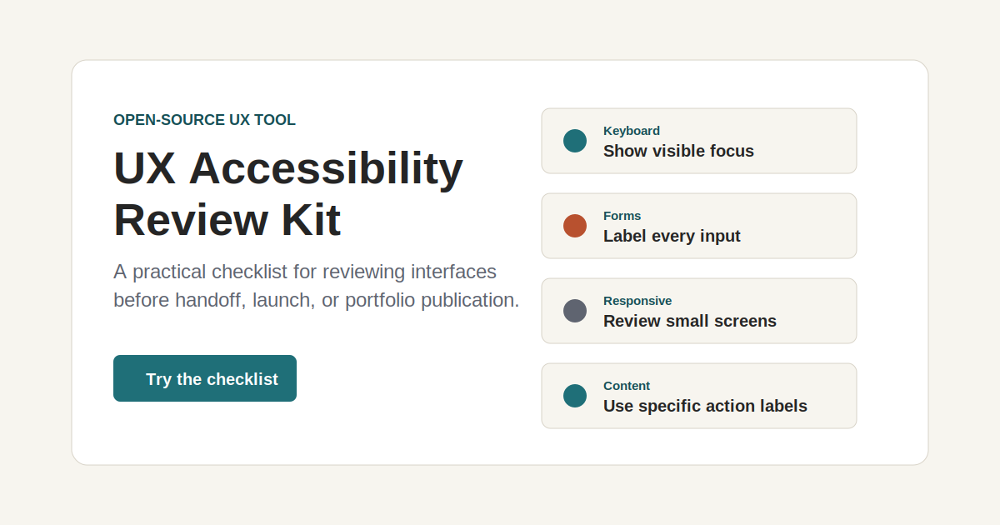
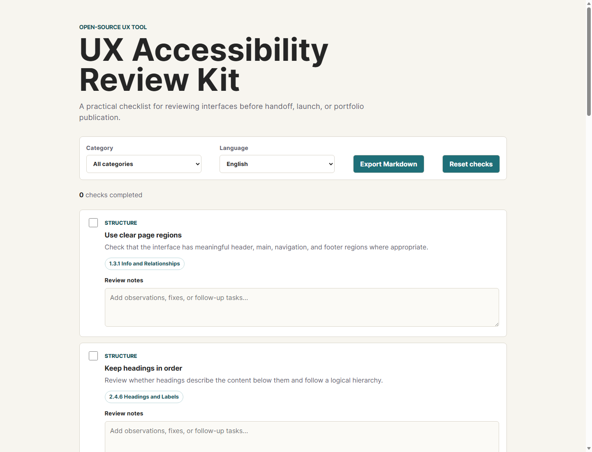

# UX Accessibility Review Kit

[](https://github.com/boki-s/ux-accessibility-review-kit/actions/workflows/pages.yml)
[](https://github.com/boki-s/ux-accessibility-review-kit/releases)
[](LICENSE)

An open-source checklist and lightweight review tool for designers, product teams, and early-stage builders who want to catch common accessibility and usability issues before handoff.

The project turns a UX review into a repeatable process, with checks for structure, readability, keyboard access, forms, responsive layouts, motion, and content clarity.




## Demo

- Live demo: https://boki-s.github.io/ux-accessibility-review-kit/
- Source: https://github.com/boki-s/ux-accessibility-review-kit

## Why This Exists

Many small teams do not have a dedicated accessibility specialist. This kit gives designers and contributors a shared starting point for reviewing interfaces with care, especially before publishing portfolio projects, landing pages, dashboards, or forms.

The goal is not to replace a full WCAG audit. It is a practical first pass that helps teams notice issues earlier, write clearer review notes, and build better habits.

## Who It Helps

- Freelance UX/UI designers reviewing client work
- Junior designers preparing portfolio projects
- Small product teams without a dedicated accessibility reviewer
- Developers who want a plain-language pre-launch checklist
- Mentors, educators, and design communities running critique sessions

## What Is Included

- A browser-based checklist app in plain HTML, CSS, and JavaScript
- WCAG references for each checklist item
- English and Serbian checklist content
- Review notes for each checklist item
- Markdown export for shareable review reports
- A structured JSON checklist that can be reused in other tools
- Saved local progress for repeated reviews
- Contribution guidelines for adding new review items
- MIT license for open use and remixing

## Local Usage

Open `index.html` in a browser. No build step is required.

## Repository Structure

```text
.
|-- .github/
|   |-- ISSUE_TEMPLATE/
|   `-- workflows/
|-- data/
|   `-- checklist.json
|-- docs/
|   `-- demo-preview.svg
|-- examples/
|   `-- login-form-review.md
|-- src/
|   |-- app.js
|   `-- styles.css
|-- CLAUDE_OSS_APPLICATION.md
|-- CODE_OF_CONDUCT.md
|-- CONTRIBUTING.md
|-- LICENSE
|-- MAINTAINER_NOTES.md
|-- ROADMAP.md
|-- SECURITY.md
|-- index.html
`-- README.md
```

## Roadmap

See `ROADMAP.md` for planned improvements, including WCAG mapping, bilingual review content, exportable reports, and design-tool workflows.

## Example Review

See `examples/login-form-review.md` for a sample review showing how checklist notes can become actionable feedback.

## Contributing

Contributions are welcome. The best additions are specific, testable, and written in plain language. See `CONTRIBUTING.md` before opening a pull request.

## License

MIT
